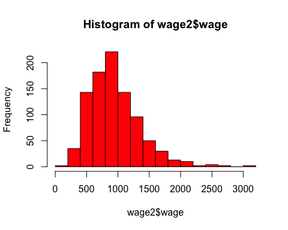

\newpage

# Problems

## Question 1

### (i) 


```r
v1 <- seq(1,17,4)

v1
```

```
[1]  1  5  9 13 17
```

### (ii)

## Question 2

### (i)


```
     [,1] [,2] [,3] [,4] [,5]
[1,]   20   21   22   23   24
[2,]   25   26   27   28   29
[3,]   30   31   32   33   34
[4,]   35   36   37   38   39
```

```
      A  B  C  D  E
[1,] 20 21 22 23 24
[2,] 25 26 27 28 29
[3,] 30 31 32 33 34
[4,] 35 36 37 38 39
```

### (ii)


```r
# Extracting Columns B & D

B <- A[c(2,4),c("B","D")]
```

### (iii)


```r
# Transpose Matrix B

t(B)
```

```
##   [,1] [,2]
## B   26   36
## D   28   38
```

### (iv)


```r
# Inverse of Matrix B

B_inverse <- solve(B)
```

### (v)


```r
B %*% B_inverse
```

```
##      [,1] [,2]
## [1,]    1    0
## [2,]    0    1
```

## Question 3

### (i)


```r
df <- data.frame(mtcars)
head(df,10)
```

```
##                    mpg cyl  disp  hp drat    wt  qsec vs am gear carb
## Mazda RX4         21.0   6 160.0 110 3.90 2.620 16.46  0  1    4    4
## Mazda RX4 Wag     21.0   6 160.0 110 3.90 2.875 17.02  0  1    4    4
## Datsun 710        22.8   4 108.0  93 3.85 2.320 18.61  1  1    4    1
## Hornet 4 Drive    21.4   6 258.0 110 3.08 3.215 19.44  1  0    3    1
## Hornet Sportabout 18.7   8 360.0 175 3.15 3.440 17.02  0  0    3    2
## Valiant           18.1   6 225.0 105 2.76 3.460 20.22  1  0    3    1
## Duster 360        14.3   8 360.0 245 3.21 3.570 15.84  0  0    3    4
## Merc 240D         24.4   4 146.7  62 3.69 3.190 20.00  1  0    4    2
## Merc 230          22.8   4 140.8  95 3.92 3.150 22.90  1  0    4    2
## Merc 280          19.2   6 167.6 123 3.92 3.440 18.30  1  0    4    4
```

### (ii)


```r
library(dplyr)
```

```
## 
## Attaching package: 'dplyr'
```

```
## The following objects are masked from 'package:stats':
## 
##     filter, lag
```

```
## The following objects are masked from 'package:base':
## 
##     intersect, setdiff, setequal, union
```

```r
df1 <- df %>% 
  select(c(cyl, hp, wt, vs, am, gear, mpg)) %>% 
  filter(cyl == 4) %>% 
  head(5)
```

### (iii)


```r
df1 %>% 
  mutate(gpm = round((1/df1$mpg),3)) %>% 
  head(5)
```

```
##   cyl hp    wt vs am gear  mpg   gpm
## 1   4 93 2.320  1  1    4 22.8 0.044
## 2   4 62 3.190  1  0    4 24.4 0.041
## 3   4 95 3.150  1  0    4 22.8 0.044
## 4   4 66 2.200  1  1    4 32.4 0.031
## 5   4 52 1.615  1  1    4 30.4 0.033
```

### (iv)


```r
str(df1)
```

```
## 'data.frame':	5 obs. of  7 variables:
##  $ cyl : num  4 4 4 4 4
##  $ hp  : num  93 62 95 66 52
##  $ wt  : num  2.32 3.19 3.15 2.2 1.61
##  $ vs  : num  1 1 1 1 1
##  $ am  : num  1 0 0 1 1
##  $ gear: num  4 4 4 4 4
##  $ mpg : num  22.8 24.4 22.8 32.4 30.4
```

### (v)


---------


# Computer Exercises


## C1 Use the data in wage1 for this exercise.

### (i) 

This is my answer to section (i)
 


# Including r output within some text 

for example I calculated the average number of cars as: 

```r
avg_speed <- mean(cars$speed)
avg_speed
```

```
## [1] 15.4
```

from the R output above, we see that the average speed is equal to 15.4. 

Or you could directly do some in-line calculations. 
Here is the average speed: 15.4. 

We can also insert plots from R in Rmarkdown: 


```r
hist(wage2$wage, col="red")
```

<!-- -->


-------------


How to write mathematical formulas in **Rmarkdown**: 

1. Writing in-line formulas using one dollar sign: $y=\beta_0 + \beta_1 x_1 + ... + \beta_k x_k + u$


2. Writing centered and stand alone formulas using 2 dollar signs: 
$$y=\beta_0 + \beta_1 x_1 + ... + \beta_k x_k + u$$
$$P(X|Y)$$

$log(salary)$

$P(X \le 6)$

$f(x)=3x^2 -2x^3$  then $0 \le x \le 1$

---------------


