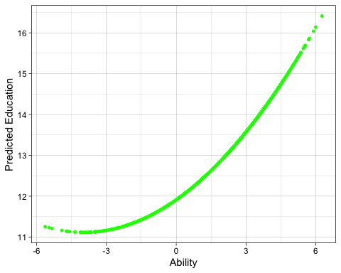

\newpage

# Problems


## Question 1

### (i) 

$E\left(\hat{\theta}_{1}\right)=E\left(\hat{\beta}_{1}+\hat{\beta}_{2}\right)=E\left(\hat{\beta}_{1}\right)+E\left(\hat{\beta}_{2}\right)=\beta_{1}+\beta_{2}=\theta_{1}$

### (ii)

$$Var(\hat{\theta_1}=
Var(\hat{\beta_1}+\hat{\beta_2})=
Var(\hat{\beta_1})+Var(\hat{\beta_2})+2Cov(\hat{\beta_1},\hat{\beta_2})=
2Corr(\hat{\beta_1},\hat{\beta_2})\sqrt{Var(\hat{\beta_1})Var(\hat{\beta_2})})$$

## Question 2

We can know that $\tilde\beta_1=\hat\beta_1+\hat\sigma*\hat\beta_2$ where $\hat\sigma_1$ is just the regression of $x_1$. We know that $\beta_2 > 0$ and we can assume that the $Corr(x_1,x_2)<0$.

\newline

We can interpret this to mean that on average, the SRM estimator will **underestimate** the effects of the training program.

\newpage 

## Question 3

### (i)

$df = n - (k - 1)$ thus, the degrees of freedom in each regression are calculated as follows: $353 - 1 - 1  = 351$ , and $353 - 2 - 1 = 350$. In the second equation, the number of explanatory variables is increased. $SRR$ and $SER$ are positively related, so $SER$ decreases when $SSR$ decreases.

### (ii)

$VIF_{years}=\frac{1}{1-0.487}=1.949$

We would expect to see moderate correlation between the variables because we know that intuitively, the longer that you are in the major leagues, there will probably be a higher likelihood that you’ll get a higher $rbisyr$. For a variety of reasons like being put up higher on the batting queue, more training, etc.

### (iii)

$SER$ for the coefficient on years in the multiple regression is lower than its counterpart in the simple regression, because adding one more independent variable reduces the overall variance which also reduces the standard error.

\newpage

## Question 4

### (i)

No, mathematically it does not make sense. The problem states that the sum of all activities must be 168, so if we change one, then at least one other category will need to change so that the sum remains 168.

### (ii)

Because we can write one variable from this function as a perfect linear function of the other independent variables, as well as for any of the other variables, this violates MLR.3.

### (iii)

I would drop one of the independent variables, like *leisure* and replace it with $u$, thus creating the new model: $$GPA = \beta_0+\beta_1study+\beta_2sleep+\beta_3work + u$$
Now, this will not violate assumption MLR.3 because if we hold sleep and work fixed, but increase study by an hour, then leisure must be falling by an hour. This would apply to the other parameters interpretations as well.

---------

\newpage

# Computer Exercises

## Question 5

### (i)


```r
d1 <- wooldridge::meapsingle

srm1 <- lm(math4~pctsgle, data = d1)
stargazer(srm1, type='text')
```

```

===============================================
                        Dependent variable:    
                    ---------------------------
                               math4           
-----------------------------------------------
pctsgle                      -0.833***         
                              (0.071)          
                                               
Constant                     96.770***         
                              (1.597)          
                                               
-----------------------------------------------
Observations                    229            
R2                             0.380           
Adjusted R2                    0.377           
Residual Std. Error      12.480 (df = 227)     
F Statistic          138.853*** (df = 1; 227)  
===============================================
Note:               *p<0.1; **p<0.05; ***p<0.01
```

The model from our output: $$math4 = 96.770 -0.833pctsgle + u$$
Our intercept is $-0.833$ which means that for each unit increase in $pctsgle$, we would see a drop in $math4$ of 0.833%. This is effect is small, but still meaningful in our interpretation.

### (ii)

```r
srm2 <- lm(math4~pctsgle+lmedinc+free, data = d1)
stargazer(srm1, srm2, type='text')
```

```

====================================================================
                                  Dependent variable:               
                    ------------------------------------------------
                                         math4                      
                              (1)                      (2)          
--------------------------------------------------------------------
pctsgle                    -0.833***                 -0.200         
                            (0.071)                  (0.159)        
                                                                    
lmedinc                                               3.560         
                                                     (5.042)        
                                                                    
free                                                -0.396***       
                                                     (0.070)        
                                                                    
Constant                   96.770***                 51.723         
                            (1.597)                 (58.478)        
                                                                    
--------------------------------------------------------------------
Observations                  229                      229          
R2                           0.380                    0.460         
Adjusted R2                  0.377                    0.453         
Residual Std. Error    12.480 (df = 227)        11.696 (df = 225)   
F Statistic         138.853*** (df = 1; 227) 63.848*** (df = 3; 225)
====================================================================
Note:                                    *p<0.1; **p<0.05; ***p<0.01
```

Adding in the variables $lmedinc$ and $free$ drops the slope coefficient of $pctsgle$ to $-0.200$. This results in our model being: $$math4=51.723-0.200pctsgle+3.560lmedinc-0.396free$$ 
With $R^2=0.460$ and $n=229$.

### (iii)


```r
cor(d1$lmedinc, d1$free)
```

```
[1] -0.7469703
```
We get a correlation of -0.746. This would be the sign that I expect because we would expect that as lmedinc decrease then the percent of free lunch would increase.

### (iv)

I would say that you should not drop one variable because they are not perfectly correlated, so this does not violate our assumptions and can still help account for the variance in our model by keeping the variables in.

### (v)

```r
pander(vif(srm2))
```


---------------------------
 pctsgle   lmedinc   free  
--------- --------- -------
  5.741     4.119    3.188 
---------------------------

The largest VIF is for pctsgle. I’d day that it does not affect our model because the VIF’s are fairly close to each other, and scrutinizing the VIF or having a cutoff for it has limited use in our analysis here.


\newpage

## Question 6

### (i)


```r
d2 <- wooldridge::htv

educ <- range(d2$educ)
print(educ[2]-educ[1])
```

```
[1] 14
```

The Range of the educ variable is **14**


```r
sum(d2$educ<13)/sum(d2$educ>0)
```

```
[1] 0.5674797
```

The proportion of men who have completed 12 grade, and no higher, is **56.7%**


```r
## Average Mens education
mean(d2$educ)
```

```
[1] 13.0374
```

```r
## Average Parents education 
(mean(d2$motheduc) + mean(d2$fatheduc))/2
```

```
[1] 12.3126
```

The average men had a mean education of **13.037** while the parents had an average of **12.313**. So the parents had less, on average, education.

### (ii)


```r
mrm1 <- lm(educ~motheduc+fatheduc, d2)
stargazer(mrm1, type='text')
```

```

===============================================
                        Dependent variable:    
                    ---------------------------
                               educ            
-----------------------------------------------
motheduc                     0.304***          
                              (0.032)          
                                               
fatheduc                     0.190***          
                              (0.022)          
                                               
Constant                     6.964***          
                              (0.320)          
                                               
-----------------------------------------------
Observations                   1,230           
R2                             0.249           
Adjusted R2                    0.248           
Residual Std. Error      2.042 (df = 1227)     
F Statistic          203.684*** (df = 2; 1227) 
===============================================
Note:               *p<0.1; **p<0.05; ***p<0.01
```

The resulting model is: $$educ=6.964+0.304motheduc+0.190fatheduc$$ With an $R^2: 0.249$ and $n=1230$. This means that 24.8% of the variation in education is explained by parents education. We can interpret our coefficients to mean that for every increase in a mothers education, the son will increase by 0.304 years. And simililary with the fathers education.

### (iii)


```r
mrm2 <- lm(educ~motheduc+fatheduc+abil, d2)
stargazer(mrm1, mrm2, type='text')
```

```

=======================================================================
                                    Dependent variable:                
                    ---------------------------------------------------
                                           educ                        
                               (1)                       (2)           
-----------------------------------------------------------------------
motheduc                    0.304***                  0.189***         
                             (0.032)                   (0.029)         
                                                                       
fatheduc                    0.190***                  0.111***         
                             (0.022)                   (0.020)         
                                                                       
abil                                                  0.502***         
                                                       (0.026)         
                                                                       
Constant                    6.964***                  8.449***         
                             (0.320)                   (0.290)         
                                                                       
-----------------------------------------------------------------------
Observations                  1,230                     1,230          
R2                            0.249                     0.428          
Adjusted R2                   0.248                     0.426          
Residual Std. Error     2.042 (df = 1227)         1.784 (df = 1226)    
F Statistic         203.684*** (df = 2; 1227) 305.172*** (df = 3; 1226)
=======================================================================
Note:                                       *p<0.1; **p<0.05; ***p<0.01
```

Our resulting model is now: $$educ=8.449+0.189motheduc+0.111fatheduc+0.502abil$$ With an $R^2: 0.428$ and $n=1230$

\newline

By adding the variable $abil$ we were able to explain 42.8% of the variation of $educ$. Controlling for parent's education, we can see the increase from our first model to this model.

### (iv)

```r
sqabil <- d2$abil^2
mrm3 <- lm(educ~motheduc+fatheduc+abil+sqabil, d2)
stargazer(mrm2, mrm3, type='text')
```

```

=======================================================================
                                    Dependent variable:                
                    ---------------------------------------------------
                                           educ                        
                               (1)                       (2)           
-----------------------------------------------------------------------
motheduc                    0.189***                  0.190***         
                             (0.029)                   (0.028)         
                                                                       
fatheduc                    0.111***                  0.109***         
                             (0.020)                   (0.020)         
                                                                       
abil                        0.502***                  0.401***         
                             (0.026)                   (0.030)         
                                                                       
sqabil                                                0.051***         
                                                       (0.008)         
                                                                       
Constant                    8.449***                  8.240***         
                             (0.290)                   (0.287)         
                                                                       
-----------------------------------------------------------------------
Observations                  1,230                     1,230          
R2                            0.428                     0.444          
Adjusted R2                   0.426                     0.443          
Residual Std. Error     1.784 (df = 1226)         1.758 (df = 1225)    
F Statistic         305.172*** (df = 3; 1226) 244.906*** (df = 4; 1225)
=======================================================================
Note:                                       *p<0.1; **p<0.05; ***p<0.01
```


```r
mrm3_df <- as.data.frame(mrm3[1])
abil_coef <- mrm3_df[4,]
abil_coef_sq <- mrm3_df[5,]

min_abil <- -abil_coef / (abil_coef_sq*2)
print(min_abil)
```

```
[1] -3.967098
```
Our model would predict education at a minimized ability level of **-3.9671.**

### (v)

```r
table(d2$abil <= min_abil)
```

```

FALSE  TRUE 
 1215    15 
```
Based on our data, only 15 men would have an "ability" less than the predicted calculated level. This is important because this tells us that there are 15 men that have an ability less than -3.967, yet have an education that is $\geq0$.

### (vi)

```r
estimate <- mrm3_df[1,] + (mrm3_df[2,]*mean(d2$motheduc)) + (mrm3_df[3,]*mean(d2$fatheduc)) + (mrm3_df[4,]*d2$abil) + mrm3_df[5,]*sqabil
  
d2 %>% 
  ggplot(aes(x=abil,y=estimate))+
  geom_point(size=1, color="green")+
  ylab("Predicted Education")+
  xlab ("Ability")+
  theme_linedraw()
```

<!-- -->

