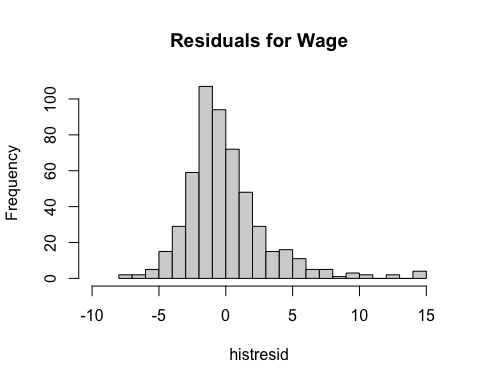
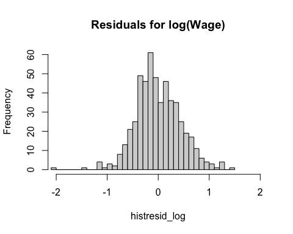
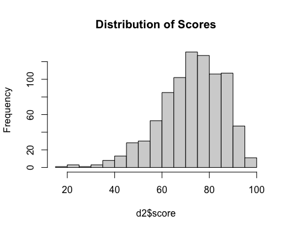

\newpage

# Problems


## Question 1

### (i) 

A larger tolerance ($risktol$) means that there is more willingness to invest in the stock market. $funds$ and $risktol$ are given to be positively correlated. If $x_2$ has a positive partial effect on the dependent variable $pctstck$, such that $\beta_2 > 0$ then the inconsistency is positive.  

\newline

$\hat{\beta_1}$ has a positive inconsistency (asymptotic). If we take out $risktol$ from the regression and it is positively correlated with $funds$, some of the effect of $funds$ is due to the effect of $risktol$

---------

\newpage

# Computer Exercises

## Question 2

### (i) 


```r
d1 <- wage1
mrm1 <- lm(wage~educ+exper+tenure, d1)
pander(summary(mrm1))
```


---------------------------------------------------------------
     &nbsp;        Estimate   Std. Error   t value   Pr(>|t|)  
----------------- ---------- ------------ --------- -----------
 **(Intercept)**    -2.873      0.729      -3.941    9.225e-05 

    **educ**        0.599      0.05128      11.68    3.681e-28 

    **exper**      0.02234     0.01206      1.853     0.06447  

   **tenure**       0.1693     0.02164      7.82     2.935e-14 
---------------------------------------------------------------


--------------------------------------------------------------
 Observations   Residual Std. Error   $R^2$    Adjusted $R^2$ 
-------------- --------------------- -------- ----------------
     526               3.084          0.3064       0.3024     
--------------------------------------------------------------

Table: Fitting linear model: wage ~ educ + exper + tenure

The estimated model is: $wage=-2.873+0.599educ+0.02234exper+0.1693tenure$

\newline

This gives us an $n=526$. and an $R^2=0.306$


```r
histresid <- resid(mrm1)
hist(histresid,breaks = 25, main= "Residuals for Wage", xlim=c(-10,15))
```

<!-- -->

### (ii)


```r
mrm1_log <- lm(lwage~educ+exper+tenure, d1)
pander(summary(mrm1_log))
```


---------------------------------------------------------------
     &nbsp;        Estimate   Std. Error   t value   Pr(>|t|)  
----------------- ---------- ------------ --------- -----------
 **(Intercept)**    0.2844      0.1042      2.729    0.006562  

    **educ**       0.09203     0.00733      12.56    8.824e-32 

    **exper**      0.004121    0.001723     2.391     0.01714  

   **tenure**      0.02207     0.003094     7.133    3.294e-12 
---------------------------------------------------------------


-------------------------------------------------------------
 Observations   Residual Std. Error   $R^2$   Adjusted $R^2$ 
-------------- --------------------- ------- ----------------
     526              0.4409          0.316       0.3121     
-------------------------------------------------------------

Table: Fitting linear model: lwage ~ educ + exper + tenure

The estimated model is: $wage=0.284+0.092educ+0.0041exper+0.02207tenure$

\newline

This gives us an $n=526$. and an $R^2=0.316$


```r
histresid_log <- resid(mrm1_log)
hist(histresid_log, breaks = 25, main= "Residuals for log(Wage)", xlim=c(-2,2))
```

<!-- -->


### (iii)

I would say that our MLR6 assumption is closer to being satisfied in our log-level model than our level-level model. Looking at the residuals for our level-level model, there is a large right skewed in the residuals that quite far from the mean. We appear to have a much more normal distribution of residuals in our log-level model.

\newpage

## Question 3

### (i)


```r
d2 <- econmath
pander(paste("The minimum score would be: " ,min(d2$score), " \nThe maximum score would be: ", max(d2$score)))
```

The minimum score would be:  19.53  
The maximum score would be:  98.44
Logically, we wouldn't expect to see any scores <0% and no score >100%.

### (ii)

```r
hist(d2$score, breaks = 25, main="Distribution of Scores")
```

<!-- -->
Looking at our histogram of math scores, we can see that they are skewed left. Given this, we have violated normality assumptions in our data and therefore, assuming that MLR.6 will not hold for error term $u$. This would mean that t stat would not have the correct distribution and neither would our F stat. 

### (iii)


```r
mrm2 <- lm(score~colgpa+actmth+acteng, d2)
pander(summary(mrm2))
```


---------------------------------------------------------------
     &nbsp;        Estimate   Std. Error   t value   Pr(>|t|)  
----------------- ---------- ------------ --------- -----------
 **(Intercept)**    16.17        2.8        5.776    1.093e-08 

   **colgpa**       12.37       0.7151      17.29    2.867e-57 

   **actmth**       0.8834      0.1122      7.873    1.109e-14 

   **acteng**      0.05176      0.1111     0.4661     0.6413   
---------------------------------------------------------------


--------------------------------------------------------------
 Observations   Residual Std. Error   $R^2$    Adjusted $R^2$ 
-------------- --------------------- -------- ----------------
     814               10.35          0.3972       0.395      
--------------------------------------------------------------

Table: Fitting linear model: score ~ colgpa + actmth + acteng

The estimated model is: $score=16.17+12.37colgpa+0.8834actmth+0.05176acteng$

\newline

This gives us an $n=814$. and an $R^2=0.3972$

\newline

Our estimated t value would be 0.4661 and P-value would be 0.6413

I would disagree with their statement that I, "cannot trust the P-value" because we are using a large sample size. Therefore, we can ignore MLR.6 since the central limit theorem will apply and we can trust the P-value from our model.
